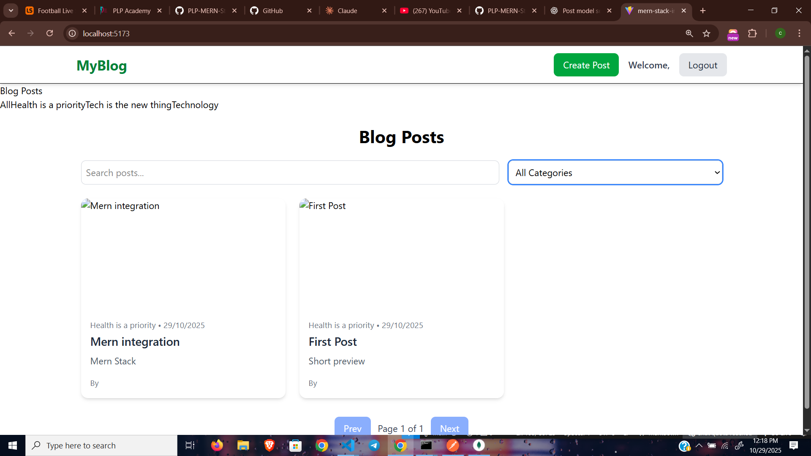

# 📰 MERN Blog Platform

A modern full-stack blog application built with **MongoDB**, **Express.js**, **React**, and **Node.js**, featuring user-friendly UI components via **Shadcn UI** and clean architecture for scalability.

## Screenshots of the application


---

## 🚀 Project Overview

This platform allows users to:
- Browse blog posts
- View single posts in detail
- Create and edit blog posts
- Categorize posts
- Manage posts and categories via REST API

It is designed as a modular MERN stack application with reusable services, efficient API handling, and clean UI structure with React and Tailwind CSS through Shadcn UI components.

---

## 🛠️ Tech Stack

| Layer       | Technology            |
|------------|------------------------|
| Frontend    | React + Vite + Shadcn UI |
| Backend     | Node.js + Express.js   |
| Database    | MongoDB + Mongoose     |
| Styling     | Tailwind CSS           |
| Routing     | React Router DOM       |
| Tools       | Axios, dotenv, Postman |

---

## ⚙️ Setup Instructions

### ✅ 1. Clone the repository
```bash
git clone <repo-url>
cd blog-platform

## Backend Setup 
cd server
npm install

## Create .env file:
PORT=5000
MONGO_URI=your_mongo_connection_string
JWT_SECRET=randomlongsecretkey

## Start backend:
npm run dev

## 3. Frontend Setup
cd client
npm install
npm run dev

## API Documentation
| Method | Endpoint    | Description        | Body Params        |
| ------ | ----------- | ------------------ | ------------------ |
| GET    | /categories | Get all categories | -                  |
| POST   | /categories | Create a category  | `{ name: string }` |

| Method | Endpoint     | Description       | Body Params                              |
| ------ | ------------ | ----------------- | ---------------------------------------- |
| GET    | /posts       | Get all posts     | -                                        |
| GET    | /posts/:slug | Get single post   | -                                        |
| POST   | /posts       | Create a new post | `{ title, content, category, tags[] }`   |
| PUT    | /posts/:slug | Update a post     | `{ title?, content?, category?, tags? }` |
| DELETE | /posts/:slug | Delete a post     | -                                        |

✅ Features Implemented
✅ Backend

RESTful API architecture

Mongoose models with pre-save hooks (auto slug generation)

Category management

Post creation, listing, editing & deletion

Error handling & validation

✅ Frontend

React functional components

React Router for navigation

Custom API hooks

Post List view (Shadcn UI Cards)

Single Post view

Create/Edit Post Form (with dropdown category)

Responsive layout

---

